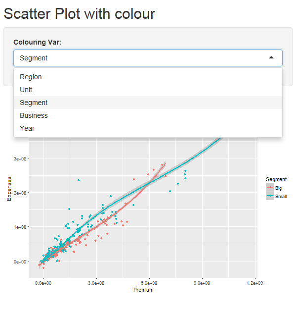

# Objective
To learn what is a loss ratio

# Content
1) There was some new content published. You need to "Update" your repository. [Use pull request or command line](https://github.com/ex-man/GeneralInsurance_Class/blob/master/Lessons/Lesson1/Exercises/Ex03_CompareForks.md#synchronize-with-our-class) (10min)
2) [Introduction to loss and expense ratios](Support/L3_loss_and_expense_ratios.md). This will help you finish excercise above (15 min)  *the last sentence needs fixing*
3) [Introduction to shiny](Support/L3_intro_to_shiny.md) (45 min)

#### Feedback (3 min)  
Please fill in [survey](https://forms.office.com/Pages/ResponsePage.aspx?id=unI2RwfNcUOirniLTGGEDmMCeqOOjBtIuObM18vXqrtUOTlQSjZGT0s1SFBCSzU2UFRMRVpINU9LQy4u) about this lesson to help us to improve the course.  

#### Homework (~20 min) [6b]
##### Implement tidyverse example into shiny and commit into your forked repository

* Prepare interactive scatterplot (Premium vs. Expenses) we have seen in [`ggplot2` example](Support/About_tidyverse_files/figure-markdown_github-ascii_identifiers/unnamed-chunk-13-1.png) and make __colouring__ of the scatter points dynamic based on not only `Region`, but for all categorical variable available in data set `dt_KPI`. Use `shiny` framework
* Save your application into `Lessons/Lesson3/Homework` and `commit` it to your forked repository

> Hint: instead of `aes` you might need `aes_string` 

It might look something like this:  

`
